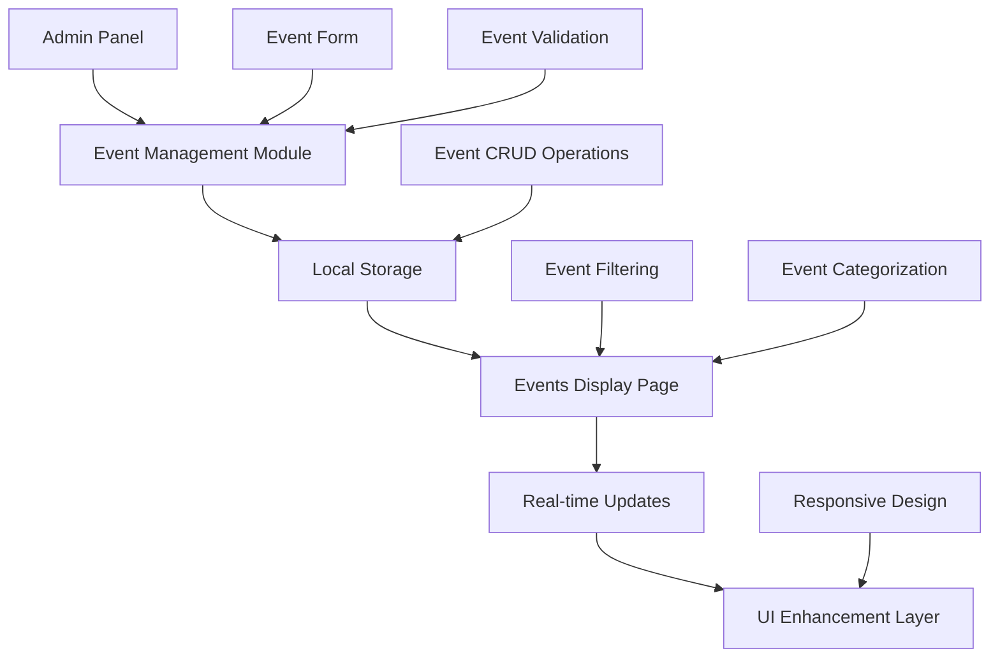

# Design Document

## Overview

The Event Management System will enhance the existing academic portfolio website by implementing a comprehensive event management solution with real-time updates and improved UI/UX. The system will leverage the existing localStorage-based architecture while adding new features for seamless event creation, management, and display.

## Architecture

### System Components



### Data Flow Architecture

1. **Admin Creates Event** → Event Form → Validation → Local Storage → Real-time Update
2. **User Views Events** → Events Page → Filter/Sort → Display with Enhanced UI
3. **Admin Edits Event** → Pre-populated Form → Validation → Update Storage → Refresh Display
4. **System Auto-categorizes** → Date Check → Move to Past/Upcoming → Update Display

## Components and Interfaces

### 1. Event Data Model

```javascript
interface Event {
    id: number;           // Unique identifier (timestamp-based)
    title: string;        // Event title
    date: string;         // Event date (YYYY-MM-DD format)
    location: string;     // Event location
    type: string;         // Event type (Conference, Workshop, etc.)
    description: string;  // Event description
    createdAt: string;    // Creation timestamp
    updatedAt: string;    // Last update timestamp
}
```

### 2. Event Management Interface

```javascript
interface EventManager {
    // CRUD Operations
    createEvent(eventData: Omit<Event, 'id' | 'createdAt' | 'updatedAt'>): Event;
    updateEvent(id: number, eventData: Partial<Event>): Event;
    deleteEvent(id: number): boolean;
    getEvent(id: number): Event | null;
    getAllEvents(): Event[];
    
    // Filtering and Sorting
    getUpcomingEvents(): Event[];
    getPastEvents(): Event[];
    getEventsByType(type: string): Event[];
    sortEventsByDate(events: Event[], ascending: boolean): Event[];
    
    // Validation
    validateEventData(eventData: any): ValidationResult;
}
```

### 3. UI Enhancement Components

#### Event Card Component
- **Purpose**: Display individual event information with enhanced styling
- **Features**: Hover effects, type-based icons, date formatting, responsive design
- **Styling**: Modern card design with gradients, shadows, and smooth transitions

#### Filter System Component
- **Purpose**: Allow users to filter events by category (upcoming, past, all)
- **Features**: Active state indicators, smooth transitions, responsive layout
- **Styling**: Pill-shaped buttons with gradient backgrounds and hover effects

#### Admin Panel Integration
- **Purpose**: Seamlessly integrate event management into existing admin interface
- **Features**: Form validation, success/error feedback, modal dialogs
- **Styling**: Consistent with existing admin panel design system

### 4. Real-time Update System

```javascript
interface RealTimeUpdater {
    // Event Listeners
    onEventCreate(callback: (event: Event) => void): void;
    onEventUpdate(callback: (event: Event) => void): void;
    onEventDelete(callback: (eventId: number) => void): void;
    
    // Update Methods
    updateEventsDisplay(): void;
    refreshEventFilters(): void;
    syncWithStorage(): void;
}
```

## Data Models

### Event Storage Schema

```json
{
  "allEvents": [
    {
      "id": 1640995200000,
      "title": "International Conference on AI & Machine Learning",
      "date": "2025-03-15",
      "location": "New Delhi, India",
      "type": "Conference",
      "description": "Keynote speaker on 'Future of AI in Healthcare Systems'",
      "createdAt": "2024-12-31T10:00:00Z",
      "updatedAt": "2024-12-31T10:00:00Z"
    }
  ]
}
```

### UI State Management

```javascript
interface UIState {
    currentFilter: 'upcoming' | 'past' | 'all';
    isAdminMode: boolean;
    editingEventId: number | null;
    isLoading: boolean;
    sortOrder: 'asc' | 'desc';
}
```

## Error Handling

### Validation Rules

1. **Required Fields**: Title, date, location, type, description
2. **Date Validation**: Must be valid date format, can be past or future
3. **Type Validation**: Must be one of predefined types
4. **Length Limits**: Title (max 100 chars), description (max 500 chars)

### Error States

```javascript
interface ValidationError {
    field: string;
    message: string;
    code: string;
}

interface ErrorHandler {
    validateForm(formData: FormData): ValidationError[];
    displayErrors(errors: ValidationError[]): void;
    clearErrors(): void;
    showSuccessMessage(message: string): void;
}
```

### Error Recovery

- **Storage Failures**: Fallback to default events, user notification
- **Validation Failures**: Highlight invalid fields, show specific error messages
- **Network Issues**: Graceful degradation, offline functionality maintained

## Testing Strategy

### Unit Testing Focus Areas

1. **Event CRUD Operations**
   - Create event with valid data
   - Update existing event
   - Delete event and verify removal
   - Validate event data structure

2. **Date Handling and Categorization**
   - Correctly identify upcoming vs past events
   - Handle edge cases (today's events, invalid dates)
   - Sort events chronologically

3. **Form Validation**
   - Required field validation
   - Date format validation
   - Character limit enforcement

### Integration Testing

1. **Admin Panel Integration**
   - Event creation flow from admin panel
   - Form submission and storage update
   - Real-time display updates

2. **Cross-page Communication**
   - Events created in admin appear on events page
   - Storage synchronization between pages
   - Filter state persistence

### UI/UX Testing

1. **Responsive Design**
   - Mobile layout functionality
   - Touch interaction support
   - Screen reader compatibility

2. **Visual Feedback**
   - Loading states during operations
   - Success/error message display
   - Smooth animations and transitions

## Enhanced UI Design Specifications

### Color Palette Integration

- **Primary**: `#0891b2` (Cyan-600) - Main brand color
- **Secondary**: `#14b8a6` (Teal-500) - Accent color
- **Success**: `#10b981` (Emerald-500) - Success states
- **Warning**: `#f59e0b` (Amber-500) - Warning states
- **Error**: `#ef4444` (Red-500) - Error states

### Typography Enhancements

- **Headers**: Playfair Display (serif) for elegance
- **Body**: Inter (sans-serif) for readability
- **Hierarchy**: Clear size differentiation (2xl, xl, lg, base)
- **Weight**: Strategic use of 400, 500, 600, 700

### Animation and Interaction Design

1. **Micro-interactions**
   - Button hover effects with transform and shadow
   - Card hover animations with lift effect
   - Loading spinners and progress indicators

2. **Page Transitions**
   - Smooth fade-in animations for new events
   - Staggered animations for event lists
   - Filter transition effects

3. **Responsive Behavior**
   - Mobile-first approach
   - Touch-friendly interface elements
   - Adaptive layouts for different screen sizes

### Accessibility Considerations

1. **Keyboard Navigation**
   - Tab order optimization
   - Focus indicators
   - Keyboard shortcuts for common actions

2. **Screen Reader Support**
   - Semantic HTML structure
   - ARIA labels and descriptions
   - Alt text for icons and images

3. **Visual Accessibility**
   - High contrast ratios
   - Scalable text and UI elements
   - Color-blind friendly design

## Performance Optimization

### Loading Strategy

1. **Lazy Loading**: Load events progressively as user scrolls
2. **Caching**: Implement intelligent caching for frequently accessed data
3. **Debouncing**: Optimize search and filter operations

### Memory Management

1. **Event Cleanup**: Remove event listeners on component unmount
2. **Storage Optimization**: Compress stored data when possible
3. **DOM Optimization**: Minimize DOM manipulations during updates

## Security Considerations

### Data Validation

1. **Input Sanitization**: Clean all user inputs before storage
2. **XSS Prevention**: Escape HTML content in event descriptions
3. **Data Integrity**: Validate data structure before processing

### Admin Access Control

1. **Password Protection**: Maintain existing admin authentication
2. **Session Management**: Implement session timeouts for admin access
3. **Audit Trail**: Log admin actions for accountability

## Browser Compatibility

### Supported Browsers

- **Modern Browsers**: Chrome 90+, Firefox 88+, Safari 14+, Edge 90+
- **Mobile Browsers**: iOS Safari 14+, Chrome Mobile 90+
- **Fallbacks**: Graceful degradation for older browsers

### Feature Detection

```javascript
interface BrowserSupport {
    localStorage: boolean;
    flexbox: boolean;
    grid: boolean;
    animations: boolean;
    touchEvents: boolean;
}
```

## Deployment Considerations

### File Structure

```
project/
├── admin.html (enhanced with event management)
├── events.html (enhanced UI and functionality)
├── admin.js (updated with event CRUD)
├── script.js (updated with event display logic)
├── style.css (enhanced with new UI components)
└── admin.css (updated admin panel styles)
```

### Configuration

- **Environment Variables**: None required (client-side only)
- **Build Process**: No build step required (vanilla JavaScript)
- **Dependencies**: Font Awesome icons, Google Fonts (existing)

This design provides a comprehensive foundation for implementing the event management system while maintaining consistency with the existing academic portfolio design and ensuring optimal user experience across all devices.